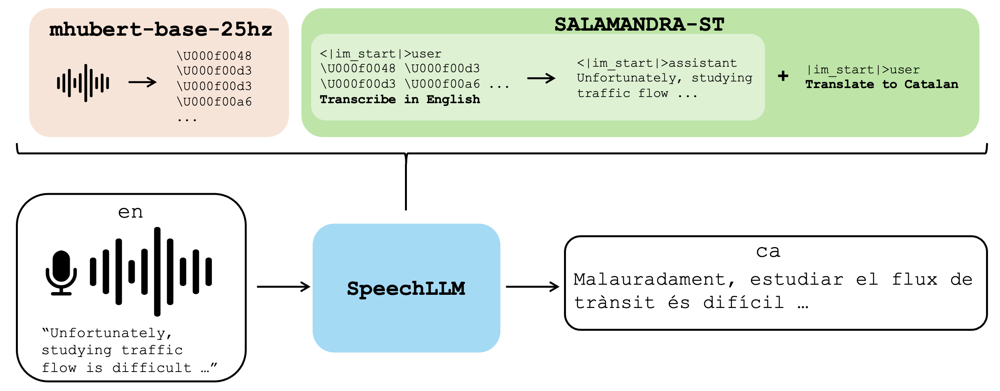
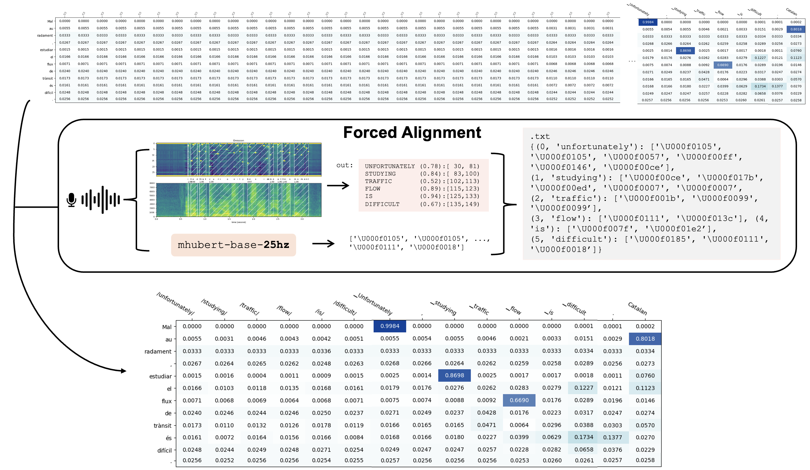

# Context Mixing: Audio + Text Attribution

This repository provides tools to analyze **context mixing** in multimodal Speech-to-Text Translation (S2TT) systems, specifically how **audio** and **textual transcripts** contribute to model predictions.  
It uses **Captum** to compute token-level attributions over both modalities.

---

## Motivation

When evaluating multimodal models that combine **audio** and **text**, it is important to understand which modality actually drives the model output.

### 1. Modality attribution in SpeechLLMs

Our first motivation is to study **SpeechLLMs** that take speech-derived audio representations together with text instructions or prompts. In this setting, we want to measure how much the final output depends on each modality.

In particular, we focus on **SALAMANDRA-ST**, a **Chain-of-Thought (CoT)** speech translation system in which the input audio is first encoded into discrete units using **mHuBERT-25Hz**. Rather than translating directly from speech, SALAMANDRA-ST first **transcribes** these speech-derived representations and then **translates** the resulting text. In principle, this CoT setup should make explicit use of the audio tokens during the transcription step, since the model has direct access to the encoded speech signal. Our goal is to analyze whether this is actually the case in practice.

More specifically, we are interested in the attribution of the generated translation with respect to:
- the **audio input**, and
- the **textual context or prompt**.

<p align="center">
  
</p>

A current limitation is that frameworks such as **Captum** do not yet provide a straightforward way to attribute the full **language modeling / decoding process**, i.e. the sequence of tokens generated during translation. This makes the study less interpretable than desired. A future version of the project may incorporate this once such functionality becomes available.

### 2. Word-level audio attribution through forced alignment

Our second motivation is specific to the **audio modality**. Existing attribution frameworks such as Captum do not provide directly interpretable scores over audio in a form that is useful for analysis. In practice, attribution over individual audio units or tokens is often too fine-grained to be meaningful on its own, inspecting isolated audio tokens is not very informative. Instead, we want to aggregate audio contribution at the level of **words**, which is much easier to interpret. To do this, we use forced alignment to obtain word-level start and end times, and then map the corresponding mHuBERT units to each word span. Since the mHuBERT representation is extracted at 25 Hz, each token corresponds to 40 ms of audio, which allows us to assign units to a given word according to where that word begins and ends in time. We then aggregate the attribution scores of all units aligned to the same word.

<p align="center">
  
</p>

---

## Overview

The project includes:

- **Attribution analysis** (`src/cmix/main.py`): unified pipeline for gradient- and perturbation-based interpretability.
- **Data management** (`src/cmix/data.py`): utilities for loading model outputs, alignments, and templates.
- **Utility functions** (`src/cmix/utils.py`): plotting, normalization, and grouped attribution scoring.
- **Optional forced alignment** (`src/cmix/alignment/forced_alignment.py`): aligns HuBERT tokens to word spans using *torchaudio* MMS.
---

## Repository Structure

```
context-mixing-audio-text/
│
├── config/
│   ├── attribution/
│   │   └── fleurs_iber_en_xx.yaml          # Example attribution config
│   └── alignment/
│       └── fleurs_iber_alignment.yaml      # Example forced alignment config
│
├── scripts/                                # SLURM or run scripts
│
├── src/
│   └── cmix/
│       ├── main.py                         # Main attribution runner
│       ├── data.py                         # Data loading & prompt handling
│       ├── utils.py                        # Attribution helpers & plotting
│       ├── distribute.py                   # Optional distributed execution
│       └── alignment/
│           ├── forced_alignment.py         # Optional audio-token alignment
│           └── README.md                   # Alignment documentation
│
└── README.md                               # Project documentation
│
└── images/                               # Images used in README.md

```

---

## Configuration

All runs are driven by **YAML configuration files**, located in `config/`.

### Example (Attribution)

```yaml
checkpoint_path: /path/to/llm/checkpoint/
results_dir: /path/to/entire_sequence/files/
aligned_huberts_dir: /path/to/aligned_huberts/
output_dir: /path/to/outputs/

attr_params:
  method: shapley-values
  skip_tokens: ["<|im_end|>", "<|im_start|>", "user", "assistant"]
  attribution_kwargs: {"n_samples": 25}

data:
  lang_pairs: ["en_es", "en_ca", "en_pt"]
  chunk_size: 1
  input_translation: true
```

---

## Running Attribution

```bash
python -m cmix.main --config config/attribution/fleurs_iber_en_xx.yaml
```

The script will:
1. Load the model checkpoint and tokenizer.
2. Parse generation results (`.entire_sequence.txt`) and aligned HuBERT files.
3. Compute attribution maps using the chosen Captum method.
4. Save results (`scores.tsv`, per-language) and plots under `output_dir`.

---

## Optional: Forced Alignment

If your S2TT system does not provide aligned or deduplicated HuBERT tokens,  
you can run the **forced alignment** preprocessing stage to build `.aligned_huberts.txt` files.

```bash
python -m cmix.alignment.forced_alignment --config config/alignment/fleurs_iber_alignment.yaml
```

See [`src/cmix/alignment/README.md`](src/cmix/alignment/README.md) for detailed usage and examples.

---

## Outputs

After running the attribution pipeline, each `{lang_pair}` directory will include:

```
scores.tsv                # aggregated audio/text contribution scores
plots/sample_XX.png       # token-level heatmaps
```

Mean values per modality (audio, transcript, translation, etc.) are printed to the console.

---

## Requirements

- Python ≥ 3.10  
- PyTorch ≥ 2.1  
- Torchaudio ≥ 2.1  
- Captum ≥ 0.7  
- Transformers ≥ 4.40  
- tqdm, matplotlib, pyyaml

Create and activate a virtual environment:

```bash
python3 -m venv .venv
source .venv/bin/activate
pip install -r requirements.txt
```

---

## Project Context

This repository is used for some of the experiments described in:

> Romero-Díaz, J. *Listening or Reading? Evaluating Speech Awareness in Chain-of-Thought Speech-to-Text Translation.*  
> ICASSP 2026 (under review)

It forms part of ongoing research at the **Barcelona Supercomputing Center (BSC-CNS)** Language Technologies Lab.

---

## Citation

If you use this work, please cite:

```
@article{romerodiaz2025cot_s2tt,
  title   = {Listening or Reading? Evaluating Speech Awareness in Chain-of-Thought Speech-to-Text Translation},
  author  = {Romero-Díaz, Jacobo and Gállego, Gerard I. and Pareras, Oriol and Costa, Federico and Hernando, Javier and España-Bonet, Cristina},
  journal = {arXiv preprint arXiv:2510.03115},
  year    = {2025}
}
```

Available at: [https://arxiv.org/abs/2510.03115](https://arxiv.org/abs/2510.03115)
